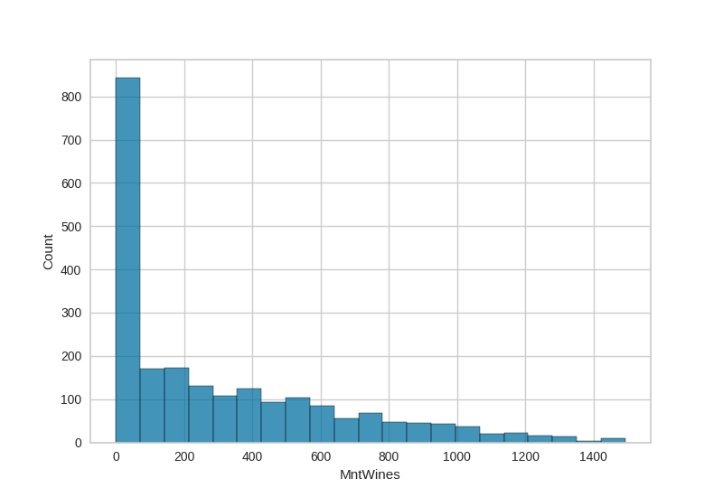
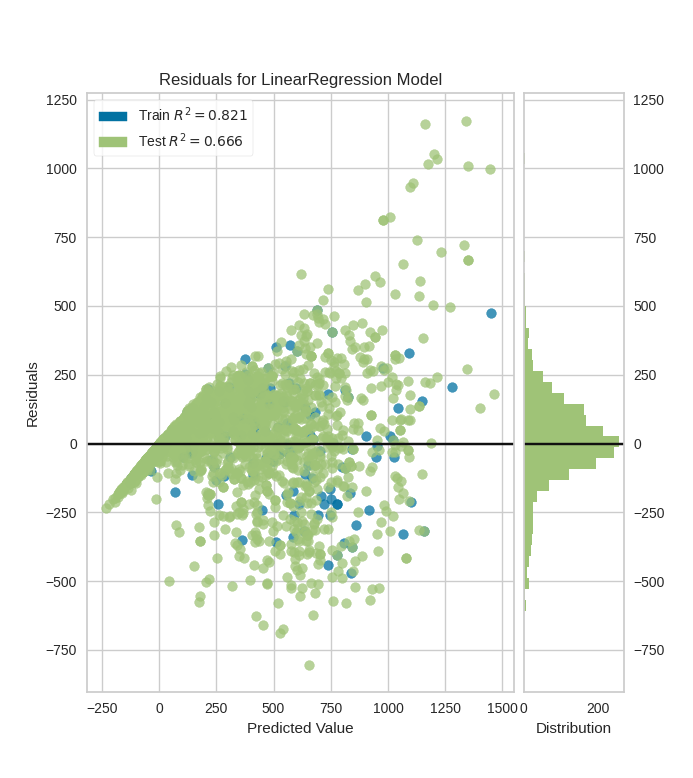
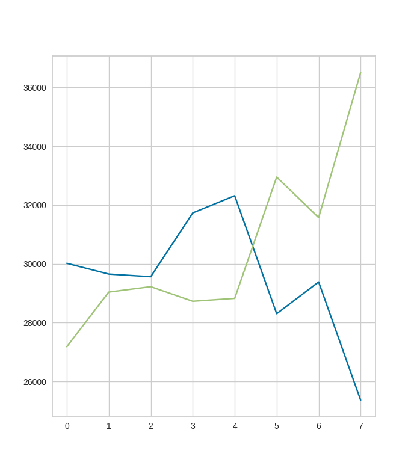

# part 1: data prep #
#### Plot the distribution of target values in your dataset. Give a high level summary of any other pertinent statistics / distributions relevant to your dataset. ####

#### 2. Look for NA or missing values, impute with a value that makes sense, drop the row as a last resort. ####
No values NA or missing

#### 3. Looking at the non-numeric columns in your dataset, decide which columns should be kept for model training. (hint: any unique identifiers should be dropped) ####
They should all be kept, there are no unique identifiers

#### 4. Of the set of non-numeric columns, decide which should be label-encoded, and which should be one-hot encoded, and then carry this out on the dataset. ####
Both education and marital status should be one-hot encoded, because there is no logical
ordering or priority to either in terms of this dataset

#### 4. Using a residuals library of your choice, plot the residuals from the linear regression model. ####

#### a. Write a few sentences analyzing this plot. ####

The distribution of residuals is roughly a bell curve centered at 0.
The models seems to have greater potential for over-estimation than for underestimation, as the largest 
positive residual is around 1200 while the absolute value of the smallest negative residual is only about 800.
The range of residuals increases as the predicted value gets larger.

#### 5. Find a way to plot or visualize the performance of the logistic regression model. ####

#### 6. Make an argument for which of the two models for the problem type you chose works better in this case ####
In this case, I would argue that linear regression is a better choice for this problem.
There is no need for the optimizations provided by SGDRegression in this case, both
models seem to take roughly the same amount of time and provide roughly equal accuracy.
In fact, in all but 2 runs of the algorithm, linear regression was actually slightly more
accurate than SGDRegression.
